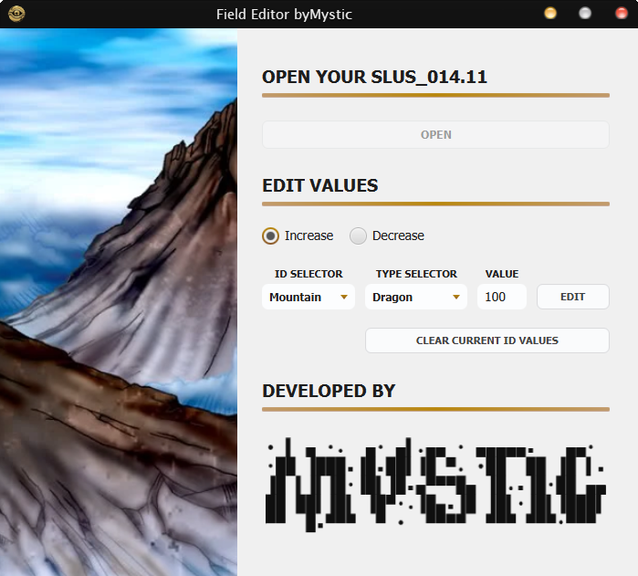

# Yu-Gi-Oh! Forbidden Memories - Field Editor byMystic

A tool to edit the values granted by Field Spells in Yu-Gi-Oh! Forbidden Memories (PlayStation) [SLUS_014.11].

<div align="center">
  
</div>

## 📖 Introduction

This tool allows you to modify the power granted by Field Spells in the aforementioned PSX game. It is only compatible with the North American version [SLUS_014.11]. You can edit any Field Spell to increase or decrease monster ATK and DFD, giving you full control over how the field mechanics behave. Please note that there is a limit to the maximum ATK/DFD values you can assign due to the game's original memory constraints.

## ⚙️ Installation

This project is currently in active development, with ongoing improvements to the user interface and alert messages. An official release is not yet available.

### Prerequisites

- **Java Development Kit (JDK):** version 23 or higher
- **Apache Maven:** version 3.6 or higher
- **Git:** for cloning the repository

### Building from Source

1. **Clone the repository:**

   ```bash
   git clone https://github.com/jmncamilo/yfm-field-editor.git
   cd yfm-field-editor
   ```

2. **Compile the project:**

   Use Maven to compile and package the application:

   ```bash
   mvn clean package
   ```

   This will generate the compiled classes and dependencies in the `target` directory.

3. **Run the application:**

   Execute the `Launcher` class directly from your IDE. The main class is located at:
   ```
   src/main/java/app/Launcher.java
   ```

## 🚀 Quickstart

This tool is incredibly user-friendly. Follow these steps to modify your game:

1. **Load the file** by opening your `SLUS_014.11` file, which is located inside the Yu-Gi-Oh! Forbidden Memories `.iso` or `.bin/.cue` image
2. **Navigate to EDIT VALUES** section where you can configure how much a monster's power will increase or decrease when a Field Spell is activated
3. **Use the ID SELECTOR** to choose the specific Field Spell card you wish to modify
4. **Use the TYPE SELECTOR** to select the monster type (e.g., Dragon, Spellcaster, etc.) that will be affected by the card
5. **Set the VALUE** to increase or decrease the ATK/DFD of the selected monster type
6. **Save your changes** by clicking the **EDIT** button to apply and save your modifications in the `SLUS_014.11`
7. **Reset values when needed** using the **CLEAR CURRENT ID VALUES** button to wipe all monster types associated with the selected card. This cleans the card, leaving it with no active effects

> _**Note**: this app is designed strictly for the original, unmodified game, as it relies on the default card names and internal logic. Given the variety of existing mods, using this tool on modified versions may cause incompatibilities._

### 💡 Pro Tip

Finally, try clicking on the **Mystic logo**... you might be surprised by what happens!

## 🔐 License

This software is distributed under the terms of the GNU Affero General Public License v3.0 (AGPLv3). A copy of this license can be found in the [LICENSE](LICENSE.txt) file. The AGPLv3 guarantees your freedoms to use, study, share, and modify this software. However, it also requires that any derivative works based on this software be distributed under the same license terms.

[](https://www.gnu.org/licenses/agpl-3.0.en.html)

## 🛠 Technology

Developed in Java using Oracle's JDK v23.0.1 and JavaFX framework v23.0.1.

## 👨🏻‍💻 Credits

Developed by Camilo Jiménez a.k.a. Mystic. This project is the result of my independent work and does not include external contributions.

## 🙌🏻 Contact & Support

Feel free to connect with me on LinkedIn or email me directly.

[](https://www.linkedin.com/in/camilojimenz)
[](mailto:jmncamilo@gmail.com)

If you find this tool helpful, please consider a small donation. Your support will help me continue developing useful tools for this amazing community. Thank you for your consideration.

[](https://www.paypal.com/donate/?hosted_button_id=8DZU725MLQKRL)
[](https://buymeacoffee.com/jmncamilo)